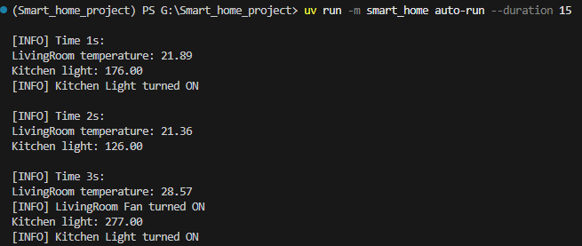
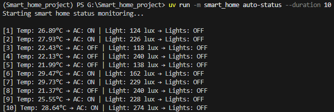
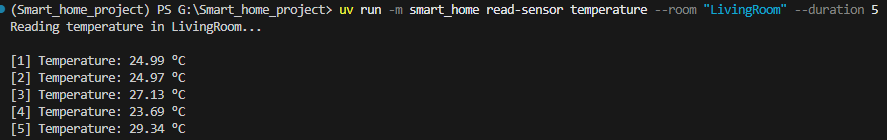
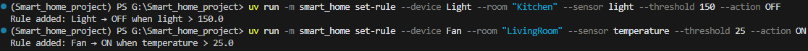
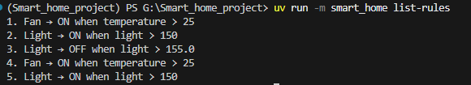
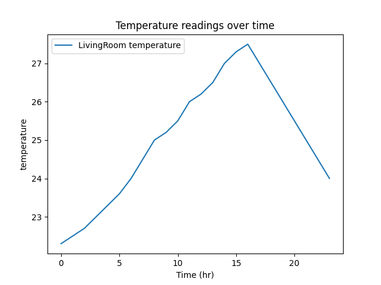

# 🏠 Smart Home Simulator (CLI Project)

## 📌 About the Project

This project is a **Smart Home Simulator** built using Python. It is
inspired by my previous work with **IoT (Internet of Things)**, where
devices and sensors interact to automate tasks in a home environment.

The system simulates: - Sensors (temperature, humidity, light) - Devices
(fan, lights, etc.) - Automation rules (turn devices ON/OFF based on
sensor values)

👉 The system works **without any physical hardware**.\
All behavior is simulated using **predefined dataset inputs and
generated sensor data**.

It is controlled entirely through a **Command Line Interface (CLI)**.

------------------------------------------------------------------------

## ⚙️ What It Does

-   Simulates real-time sensor readings\
-   Automates device behavior using rules\
-   Allows manual sensor monitoring\
-   Stores automation rules persistently (JSON)\
-   Visualizes sensor and device data using plots

------------------------------------------------------------------------

## 🚀 Commands & Usage

### 🔹 Run automation

Runs the smart home with rules applied:

``` bash
uv run -m smart_home auto-run --duration 10
```
**Output:**



---
### 🔹 Check system status

Monitors sensor values and device states:

``` bash
uv run -m smart_home auto-status --duration 5
```
**Output:**



---
### 🔹 Read sensor data

Reads a specific sensor in a room:

``` bash
uv run -m smart_home read-sensor temperature --room "LivingRoom" --duration 5
```
**Output:**



---
### 🔹 Set automation rule

Adds a rule (and saves it):

``` bash
uv run -m smart_home set-rule --device Fan --room "Living Room" --sensor temperature --threshold 25 --action ON
```
**Output:**



---
### 🔹 List rules

Shows all saved rules:

``` bash
uv run -m smart_home list-rules
```
**Output:**



---
### 🔹 Plot data

Visualize sensor or device data(Over 24 hrs period from dataset):

``` bash
uv run -m smart_home plot --sensors
uv run -m smart_home plot --devices
```
**Output:**




------------------------------------------------------------------------

## ⚠️ Note

If the program does not install or run properly:

1.  Create a virtual environment:

``` bash
uv venv
```

2.  Then install dependencies and run again.

------------------------------------------------------------------------

## ✅ Summary

This project demonstrates how IoT concepts like **sensors, devices, and
automation rules** can be simulated in software using Python --- without
any hardware. It combines **data handling, CLI design, and
visualization** into a simple and practical system.
